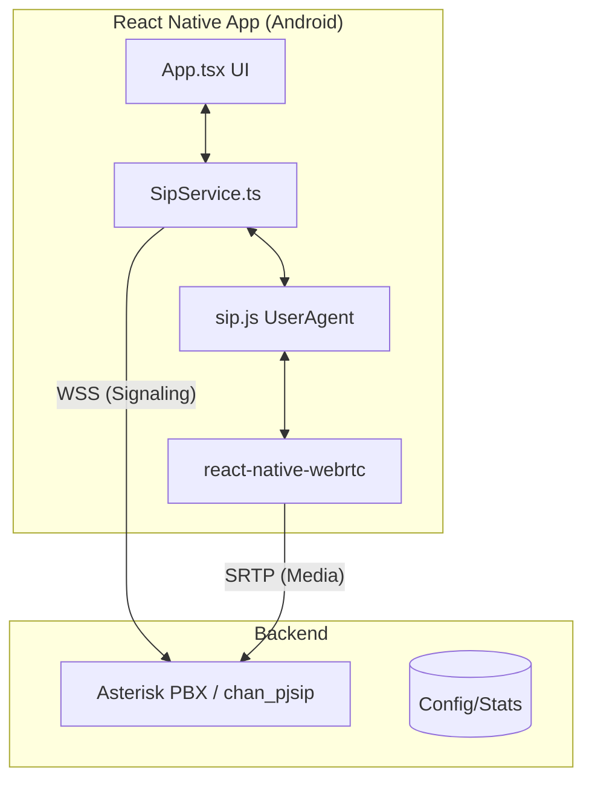

# React Native SIP/WebRTC POC

A Proof of Concept (POC) for a React Native Android SIP client using WebRTC to connect to an Asterisk PBX.

## Current Progress
- [x] Project Initialization (React Native CLI + TypeScript)
- [x] Android Permissions Configuration
- [x] SIP Service implementation with `sip.js` and `react-native-webrtc`
- [x] Basic UI for SIP Registration and Calling
- [x] Complete Android Native Template (Java/Gradle)
- [x] Git configuration (.gitignore)

## System Architecture



## Getting Started

### 1. Prerequisites
- Node.js > 18
- Android SDK & Emulator/Device
- Asterisk Server with `chan_pjsip` and WebRTC enabled (WSS)

### 2. Installation
```bash
npm install
# or
yarn install
```

### 3. Running the App
```bash
npx react-native run-android
```

## Configuration Parameters
- **WSS URL**: `wss://your-asterisk-domain:8089/ws`
- **SIP Domain**: `your-asterisk-domain`
- **Extension**: e.g., `1001`
- **Password**: Your PJSIP password

## Asterisk (chan_pjsip) WebRTC Setup
To support this client, your Asterisk `pjsip.conf` needs:
- `webrtc=yes`
- `dtls_enable=yes`
- `ice_support=yes`
- `media_use_received_transport=yes`
- `rtp_symmetric=yes`
- `force_rport=yes`
- `rewrite_contact=yes`
- A valid TLS certificate for WSS.
